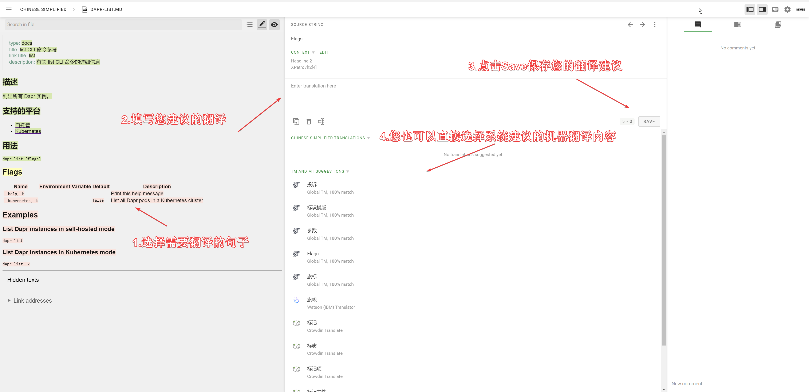

# Dapr 中文文档库

<!-- ALL-CONTRIBUTORS-BADGE:START - Do not remove or modify this section -->

<!-- ALL-CONTRIBUTORS-BADGE:END -->

目前进度： 

欢迎来到 Dapr 中文文档库。

该文档库是由 [dapr-cn](https://github.com/dapr-cn) 创建并维护的对 [docs.dapr.io](https://docs.dapr.io/) 内容的翻译。

旨在为更熟悉中文的开发者提供一些文档上的帮助。

并且，我们会定期将内容推送到官方的 docs.dapr.io 文档库。

- <https://docs.dapr.io>

## 只需要三步，您也可以参与

只要简单三步，您也可以非常轻松参与我们的工作中来。

1. [点击链接 https://crwd.in/cndocsdapr](https://crwd.in/cndocsdapr) 在 crowdin.com 上加入该翻译项目。过程中将会需要填写一些您个人的信息。
2. [点击链接 https://crowdin.com/project/cndocsdapr/zh-CN#](https://crowdin.com/project/cndocsdapr/zh-CN#) 查看并选择您感兴趣的未翻译内容。
3. 如下图所示，提交一段您的翻译建议。我们将会定时审阅您的翻译内容。并发布到站点中。

> crowdin 是一款针对开源项目免费的翻译协作软件，可以帮助您有效的进行多人翻译项目的协作管理。您也可以借助在本项目中的使用体验来应用到自己的项目中。

当然，如果您想要更好的参与的翻译协作的工作中来，我们建议您访问我们的网站 <https://daprcn-docs-team.newbe.pro/docs/intro>

## 授权协议

我们感谢所有参与该项目的贡献者，没有所有人的辛勤付出，就不会有该文库的成功运行。

局限于目前的技术，所有的贡献内容将统一署名为 dapr-cn-github dapr-cn@hotmail.com 。

本文档遵循[“保持署名—非商用”创意共享 4.0 许可证（CC BY-NC 4.0）](http://creativecommons.org/licenses/by-nc/4.0/deed.zh)，请在**保持署名**、**非商用**的前提下自由使用，你甚至可以把它架设在自己的电脑或内网服务器上。

## Contributors ✨

Thanks goes to these wonderful people ([emoji key](https://allcontributors.org/docs/en/emoji-key)):

<!-- ALL-CONTRIBUTORS-LIST:START - Do not remove or modify this section -->
<!-- prettier-ignore-start -->
<!-- markdownlint-disable -->
<table>
  <tbody>
    <tr>
      <td align="center" valign="top" width="14.28%"><a href="https://www.newbe.pro"> <b>Newbe36524</b></a> <a href="#ideas-newbe36524" title="Ideas, Planning, & Feedback">🤔</a> <a href="#translation-newbe36524" title="Translation">🌍</a></td>
      <td align="center" valign="top" width="14.28%"><a href="https://skyao.io"> <b>Sky/敖小剑</b></a> <a href="#ideas-skyao" title="Ideas, Planning, & Feedback">🤔</a> <a href="#translation-skyao" title="Translation">🌍</a></td>
      <td align="center" valign="top" width="14.28%"><a href="https://github.com/LLLLimbo"> <b>LLLLimbo</b></a> <a href="#translation-LLLLimbo" title="Translation">🌍</a></td>
      <td align="center" valign="top" width="14.28%"><a href="https://yuque.com/abser"> <b>AbserAri</b></a> <a href="#translation-abserari" title="Translation">🌍</a></td>
      <td align="center" valign="top" width="14.28%"><a href="https://www.jianshu.com/u/39ec0e6b1844?order_by=top"> <b>Shengjie Yan</b></a> <a href="#translation-sheng-jie" title="Translation">🌍</a></td>
      <td align="center" valign="top" width="14.28%"><a href="https://yuiter.com"> <b>Danvic Wang</b></a> <a href="#translation-danvic712" title="Translation">🌍</a></td>
      <td align="center" valign="top" width="14.28%"><a href="https://jadyn.wang"> <b>Jadyn</b></a> <a href="#translation-JadynWong" title="Translation">🌍</a></td>
    </tr>
    <tr>
      <td align="center" valign="top" width="14.28%"><a href="http://www.oudi.org"> <b>oudi</b></a> <a href="#translation-oudi" title="Translation">🌍</a></td>
      <td align="center" valign="top" width="14.28%"><a href="https://github.com/ZhangX-Byte"> <b>ZhangX-Byte</b></a> <a href="#translation-ZhangX-Byte" title="Translation">🌍</a></td>
      <td align="center" valign="top" width="14.28%"><a href="https://siegrain.wang"> <b>Weiyi Wong</b></a> <a href="#translation-siegrainwong" title="Translation">🌍</a></td>
      <td align="center" valign="top" width="14.28%"><a href="https://github.com/lifejoyforpy"> <b>lifejoy</b></a> <a href="#translation-lifejoyforpy" title="Translation">🌍</a></td>
      <td align="center" valign="top" width="14.28%"><a href="http://marklux.cn"> <b>Mark Lumin</b></a> <a href="#translation-MarkLux" title="Translation">🌍</a></td>
      <td align="center" valign="top" width="14.28%"><a href="http://blog.ithuo.net:8877"> <b>charleszhn</b></a> <a href="#translation-charleszhn" title="Translation">🌍</a></td>
      <td align="center" valign="top" width="14.28%"><a href="http://www.tomorjm.com"> <b>Jaime Zhang</b></a> <a href="#translation-TomorJM" title="Translation">🌍</a></td>
    </tr>
    <tr>
      <td align="center" valign="top" width="14.28%"><a href="https://www.cnblogs.com/weihanli"> <b>Weihan Li</b></a> <a href="#translation-weihanli" title="Translation">🌍</a></td>
      <td align="center" valign="top" width="14.28%"><a href="http://www.herowk.com"> <b>kyle wong</b></a> <a href="#translation-herowk" title="Translation">🌍</a></td>
      <td align="center" valign="top" width="14.28%"><a href="https://www.4async.com"> <b>ipfans</b></a> <a href="#translation-ipfans" title="Translation">🌍</a></td>
      <td align="center" valign="top" width="14.28%"><a href="https://github.com/Itoktsnhc"> <b>itoktsnhc</b></a> <a href="#translation-itoktsnhc" title="Translation">🌍</a></td>
      <td align="center" valign="top" width="14.28%"><a href="https://github.com/Stitch-Zhang"> <b>Stitch-Zhang</b></a> <a href="#translation-Stitch-Zhang" title="Translation">🌍</a></td>
      <td align="center" valign="top" width="14.28%"><a href="http://www.cnblogs.com/stulzq"> <b>Zhiqiang Li</b></a> <a href="#translation-stulzq" title="Translation">🌍</a></td>
      <td align="center" valign="top" width="14.28%"><a href="https://github.com/doddgu"> <b>鬼谷子</b></a> <a href="#translation-doddgu" title="Translation">🌍</a></td>
    </tr>
    <tr>
      <td align="center" valign="top" width="14.28%"><a href="https://blog.cong.moe"> <b>featherlight</b></a> <a href="#translation-zcong1993" title="Translation">🌍</a></td>
      <td align="center" valign="top" width="14.28%"><a href="https://github.com/Z4t4r"> <b>Z4t4r</b></a> <a href="#translation-Z4t4r" title="Translation">🌍</a></td>
      <td align="center" valign="top" width="14.28%"><a href="https://github.com/jerroldgao"> <b>Jerrold Gao</b></a> <a href="#translation-jerroldgao" title="Translation">🌍</a></td>
      <td align="center" valign="top" width="14.28%"><a href="http://www.wwbweibo.icu"> <b>wangweibo</b></a> <a href="#translation-wwbweibo" title="Translation">🌍</a></td>
      <td align="center" valign="top" width="14.28%"><a href="https://www.cnblogs.com/wiswang"> <b>Hongzhi</b></a> <a href="#translation-WisWang" title="Translation">🌍</a></td>
      <td align="center" valign="top" width="14.28%"><a href="https://www.weyhd.com"> <b>geffzhang</b></a> <a href="#translation-geffzhang" title="Translation">🌍</a></td>
      <td align="center" valign="top" width="14.28%"><a href="https://github.com/zhi-gang-sun"> <b>zhi-gang-sun</b></a> <a href="#translation-zhi-gang-sun" title="Translation">🌍</a></td>
    </tr>
    <tr>
      <td align="center" valign="top" width="14.28%"><a href="https://github.com/liyehaha"> <b>liye</b></a> <a href="#translation-liyehaha" title="Translation">🌍</a></td>
      <td align="center" valign="top" width="14.28%"><a href="https://github.com/liuyangc3"> <b>Yang Liu</b></a> <a href="#translation-liuyangc3" title="Translation">🌍</a></td>
      <td align="center" valign="top" width="14.28%"><a href="http://miaobuao.github.io"> <b>Meo</b></a> <a href="#translation-miaobuao" title="Translation">🌍</a></td>
    </tr>
  </tbody>
</table>

<!-- markdownlint-restore -->
<!-- prettier-ignore-end -->

<!-- ALL-CONTRIBUTORS-LIST:END -->

This project follows the [all-contributors](https://github.com/all-contributors/all-contributors) specification. Contributions of any kind welcome!

以上列表由手动更新而生成，如果您在其中没有找到您的名字，请在 crowdin.com 上，通过右上角的 conversation 按钮向 newbe36524 发送您的 github id。我们将及时处理。

## Crowdin 统计

我们非常珍视每一位为项目提供过翻译支持的老伙计。此处将更新截至目前的最新贡献数据。

<!-- CROWDIN-TRANSLATORS-START -->
<table style="width: 100%;"><tr>
              <td style="text-align:center; vertical-align: top;">
                  
                   
                  
                      <b>dapr-cn-github</b>
                  
                   
                  
                      <b>452745 words</b>
                  
              </td>
              <td style="text-align:center; vertical-align: top;">
                  
                   
                  
                      <b>Newbe36524 (newbe36524)</b>
                  
                   
                  
                      <b>153496 words</b>
                  
              </td>
              <td style="text-align:center; vertical-align: top;">
                  
                   
                  
                      <b>Sky/敖小剑 (skyao)</b>
                  
                   
                  
                      <b>279011 words</b>
                  
              </td>
              <td style="text-align:center; vertical-align: top;">
                  
                   
                  
                      <b>Jadyn</b>
                  
                   
                  
                      <b>53496 words</b>
                  
              </td>
              <td style="text-align:center; vertical-align: top;">
                  
                   
                  
                      <b>Mr.Black (RcXu)</b>
                  
                   
                  
                      <b>32284 words</b>
                  
              </td>
              <td style="text-align:center; vertical-align: top;">
                  
                   
                  
                      <b>betulasector</b>
                  
                   
                  
                      <b>20617 words</b>
                  
              </td>
              <td style="text-align:center; vertical-align: top;">
                  
                   
                  
                      <b>LLLLimbo (LLLimbo)</b>
                  
                   
                  
                      <b>20462 words</b>
                  
              </td></tr><tr>
              <td style="text-align:center; vertical-align: top;">
                  
                   
                  
                      <b>Sean Wong (siegrainwong)</b>
                  
                   
                  
                      <b>13907 words</b>
                  
              </td>
              <td style="text-align:center; vertical-align: top;">
                  
                   
                  
                      <b>w_Y_</b>
                  
                   
                  
                      <b>13065 words</b>
                  
              </td>
              <td style="text-align:center; vertical-align: top;">
                  
                   
                  
                      <b>geffzhang</b>
                  
                   
                  
                      <b>10339 words</b>
                  
              </td>
              <td style="text-align:center; vertical-align: top;">
                  
                   
                  
                      <b>Jerrold/高逸儒 (jerroldgao)</b>
                  
                   
                  
                      <b>8401 words</b>
                  
              </td>
              <td style="text-align:center; vertical-align: top;">
                  
                   
                  
                      <b>kyle wong (herowk)</b>
                  
                   
                  
                      <b>4739 words</b>
                  
              </td>
              <td style="text-align:center; vertical-align: top;">
                  
                   
                  
                      <b>doddgu</b>
                  
                   
                  
                      <b>2372 words</b>
                  
              </td>
              <td style="text-align:center; vertical-align: top;">
                  
                   
                  
                      <b>liye</b>
                  
                   
                  
                      <b>2051 words</b>
                  
              </td></tr><tr>
              <td style="text-align:center; vertical-align: top;">
                  
                   
                  
                      <b>七里听香 (devonline)</b>
                  
                   
                  
                      <b>3113 words</b>
                  
              </td>
              <td style="text-align:center; vertical-align: top;">
                  
                   
                  
                      <b>charleszhn</b>
                  
                   
                  
                      <b>1727 words</b>
                  
              </td>
              <td style="text-align:center; vertical-align: top;">
                  
                   
                  
                      <b>Hongzhi (WisWang)</b>
                  
                   
                  
                      <b>1697 words</b>
                  
              </td>
              <td style="text-align:center; vertical-align: top;">
                  
                   
                  
                      <b>webup</b>
                  
                   
                  
                      <b>2488 words</b>
                  
              </td>
              <td style="text-align:center; vertical-align: top;">
                  
                   
                  
                      <b>aikin (aikin-vip)</b>
                  
                   
                  
                      <b>1641 words</b>
                  
              </td>
              <td style="text-align:center; vertical-align: top;">
                  
                   
                  
                      <b>wujihua</b>
                  
                   
                  
                      <b>1338 words</b>
                  
              </td>
              <td style="text-align:center; vertical-align: top;">
                  
                   
                  
                      <b>MarkLux</b>
                  
                   
                  
                      <b>1264 words</b>
                  
              </td></tr><tr>
              <td style="text-align:center; vertical-align: top;">
                  
                   
                  
                      <b>HHao</b>
                  
                   
                  
                      <b>1015 words</b>
                  
              </td>
              <td style="text-align:center; vertical-align: top;">
                  
                   
                  
                      <b>千橘 雫霞 (qianjunakasumi)</b>
                  
                   
                  
                      <b>791 words</b>
                  
              </td>
              <td style="text-align:center; vertical-align: top;">
                  
                   
                  
                      <b>Danvic Wang (Danvic.Wang)</b>
                  
                   
                  
                      <b>615 words</b>
                  
              </td>
              <td style="text-align:center; vertical-align: top;">
                  
                   
                  
                      <b>MregXN</b>
                  
                   
                  
                      <b>528 words</b>
                  
              </td>
              <td style="text-align:center; vertical-align: top;">
                  
                   
                  
                      <b>sun Zhenya (abelsun)</b>
                  
                   
                  
                      <b>425 words</b>
                  
              </td>
              <td style="text-align:center; vertical-align: top;">
                  
                   
                  
                      <b>stulzq</b>
                  
                   
                  
                      <b>394 words</b>
                  
              </td>
              <td style="text-align:center; vertical-align: top;">
                  
                   
                  
                      <b>Stitch-Zhang</b>
                  
                   
                  
                      <b>385 words</b>
                  
              </td></tr><tr>
              <td style="text-align:center; vertical-align: top;">
                  
                   
                  
                      <b>itoktsnhc (Itoktsnhc)</b>
                  
                   
                  
                      <b>293 words</b>
                  
              </td>
              <td style="text-align:center; vertical-align: top;">
                  
                   
                  
                      <b>oudi</b>
                  
                   
                  
                      <b>280 words</b>
                  
              </td>
              <td style="text-align:center; vertical-align: top;">
                  
                   
                  
                      <b>codjust</b>
                  
                   
                  
                      <b>208 words</b>
                  
              </td>
              <td style="text-align:center; vertical-align: top;">
                  
                   
                  
                      <b>ipfans</b>
                  
                   
                  
                      <b>192 words</b>
                  
              </td>
              <td style="text-align:center; vertical-align: top;">
                  
                   
                  
                      <b>Weihan Li (WeihanLi)</b>
                  
                   
                  
                      <b>119 words</b>
                  
              </td>
              <td style="text-align:center; vertical-align: top;">
                  
                   
                  
                      <b>pengyunlong (sunshinebaby00)</b>
                  
                   
                  
                      <b>114 words</b>
                  
              </td></tr></table>
<!-- CROWDIN-TRANSLATORS-END -->

- 该表格仅统计了参与超过 100 个词的前 100 位老伙计
- 您可以忽略管理员的贡献数字，毕竟很多自动操作也会生成贡献数据

  
由于历史的原因，翻译项目经历过迁移。前一个项目的贡献者可以展开此处进行查看。

<table style="width: 100%;"><tr>
<td style="text-align:center; vertical-align: top;">
    
     
    
        <b>Newbe36524 (newbe36524)</b>
    
     
    
        <b>79730 words</b>
    
</td>
<td style="text-align:center; vertical-align: top;">
    
     
    
        <b>Sky/敖小剑 (skyao)</b>
    
     
    
        <b>6281 words</b>
    
</td>
<td style="text-align:center; vertical-align: top;">
    
     
    
        <b>ZhangX-Byte</b>
    
     
    
        <b>4311 words</b>
    
</td>
<td style="text-align:center; vertical-align: top;">
    
     
    
        <b>fffirer</b>
    
     
    
        <b>3943 words</b>
    
</td>
<td style="text-align:center; vertical-align: top;">
    
     
    
        <b>David Zheng (msdz)</b>
    
     
    
        <b>4665 words</b>
    
</td>
<td style="text-align:center; vertical-align: top;">
    
     
    
        <b>Abser·Ari (yhyddr)</b>
    
     
    
        <b>1613 words</b>
    
</td>
<td style="text-align:center; vertical-align: top;">
    
     
    
        <b>Shengjie Yan (sheng-jie)</b>
    
     
    
        <b>6542 words</b>
    
</td></tr><tr>
<td style="text-align:center; vertical-align: top;">
    
     
    
        <b>yang liu (liuyangc3)</b>
    
     
    
        <b>652 words</b>
    
</td>
<td style="text-align:center; vertical-align: top;">
    
     
    
        <b>betulasector</b>
    
     
    
        <b>589 words</b>
    
</td>
<td style="text-align:center; vertical-align: top;">
    
     
    
        <b>Yongguang Zhu (heavenwing)</b>
    
     
    
        <b>604 words</b>
    
</td>
<td style="text-align:center; vertical-align: top;">
    
     
    
        <b>pengyunlong (sunshinebaby00)</b>
    
     
    
        <b>522 words</b>
    
</td>
<td style="text-align:center; vertical-align: top;">
    
     
    
        <b>mrpengfei</b>
    
     
    
        <b>508 words</b>
    
</td>
<td style="text-align:center; vertical-align: top;">
    
     
    
        <b>Jadyn</b>
    
     
    
        <b>479 words</b>
    
</td>
<td style="text-align:center; vertical-align: top;">
    
     
    
        <b>LLLLimbo (LLLimbo)</b>
    
     
    
        <b>458 words</b>
    
</td></tr><tr>
<td style="text-align:center; vertical-align: top;">
    
     
    
        <b>oudi</b>
    
     
    
        <b>379 words</b>
    
</td>
<td style="text-align:center; vertical-align: top;">
    
     
    
        <b>lifejoy (lifejoyforpy)</b>
    
     
    
        <b>157 words</b>
    
</td>
<td style="text-align:center; vertical-align: top;">
    
     
    
        <b>Danvic Wang (Danvic.Wang)</b>
    
     
    
        <b>116 words</b>
    
</td></tr></table>

