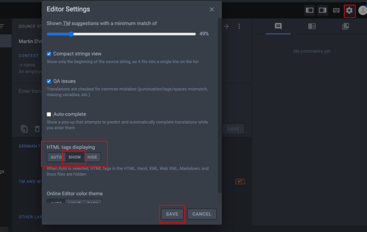
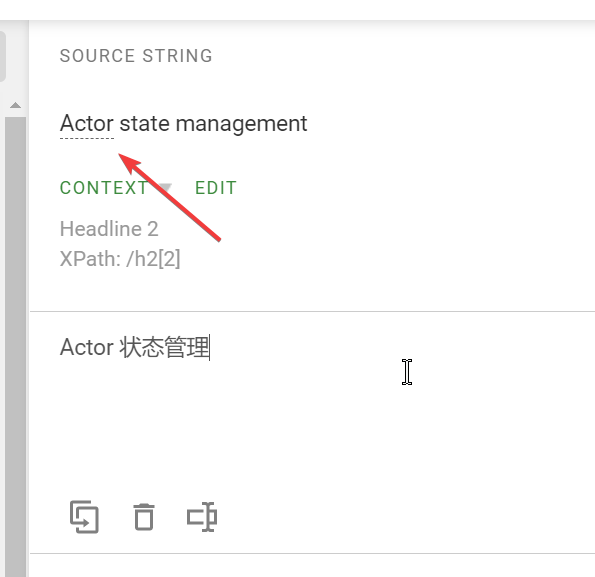
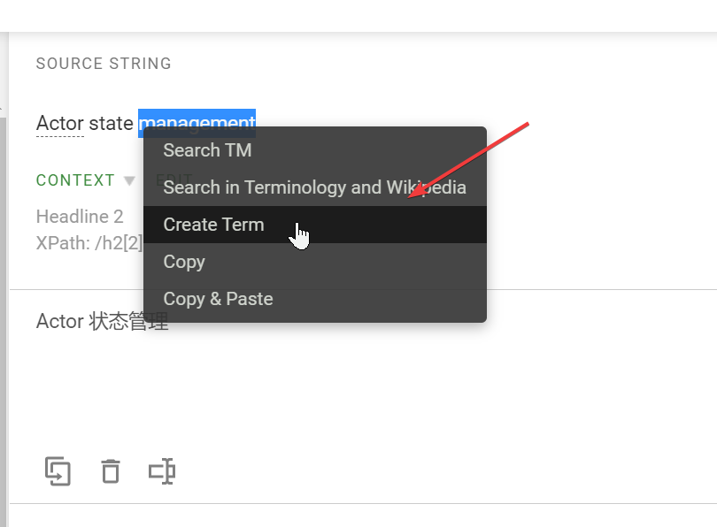

# 翻译小知识

本篇我们将介绍一下翻译过程中需要使用到的一些小知识。充分理解这些小知识，有助于您更好的与团队中的其他成员一同合作。

- [翻译小知识](#翻译小知识)
  - [设置一些必要的选项](#设置一些必要的选项)
  - [无需翻译的内容](#无需翻译的内容)
    - [代码或者代码段](#代码或者代码段)
    - [Hugo 头部标记](#hugo-头部标记)
    - [图片，链接，Hugo 文档标记](#图片链接hugo-文档标记)
    - [基本术语](#基本术语)

## 设置一些必要的选项

随意一篇需要翻译的文章，按照下图所示，进行设置：



这样可以将 HTML 标记完整的展现出来，从而避免有时 crowdin 识别标记不完整而导致的问题。

## 无需翻译的内容

在翻译的过程中会遇到一些内容，不需要翻译的情况。贸然翻译他们可能会破坏文档的结构性和可读性。因此在翻译过程中需要对这些内容不做翻译，直接保留原文。**无需任何操作。**

下面我们罗列一些无需翻译的场景：

### 代码或者代码段

显然，代码或者代码段是不应该被翻译的。请按照如下方式操作：


### Hugo 头部标记

dapr 文档库原文采用的是 Hugo 作为网站生成器。为了确保文档结构，链接完整等原因。 Hugo 文档的头部标记中仅有少部分内容需要翻译。

例如，这里有一段原文：

```md
---
type: docs
title: "Docs contributions"
linkTitle: "Docs"
weight: 2000
description: >
  Guidelines for contributing to the Dapr Docs
aliases:
  - "/developing-applications/building-blocks/actors/actors-background"
---
```

翻译的要点如下：

- 其中，除了 title、linkTitle 和 description 之外的内容都不需要翻译。
- 如果有 aliases ，则需要为对应的链接添加 `/zh-hans/`。 [此问题在这里有详细的讨论](https://github.com/dapr/docs/pull/1377#issuecomment-816822405)

因此，翻译的结果如下：

```md
---
type: docs
title: "文档贡献"
linkTitle: "文档贡献"
weight: 2000
description: >
  向 Dapr Docs 投稿的准则
aliases:
  - "/zh-hans/developing-applications/building-blocks/actors/actors-background"
---
```

### 图片，链接，Hugo 文档标记

这些内容会出现在文档的正文中。分辨这些内容可能需要译者掌握一些简单的 markdown 语法和 hugo 标记语法。

例如：

```md
Fork the [docs repository](https://github.com/dapr/docs) to work on any changes.
```

其中就包含了一个超链接的 markdown 标记。因此，链接无需修改，但是链接的文本内容还是要进行翻译。

因此，结果为：

```md
Fork [docs 代码仓库](https://github.com/dapr/docs) 并进行修改。
```

### 基本术语

基本术语，是指那些原来直接采用英文原文可能更容易理解的词组和短语。对于此类内容，不建议进行翻译。

例如，上一节中的 Fork 就是 Github 中的一个非常常见的术语，因此不建议进行翻译。

再举一个例子：

```md
Invoke an actor method through Dapr.
```

其中 Actor 和 Dapr 都是常见的基本术语。因此，不建议进行翻译。故而，翻译结果可以为：

```md
通过 Dapr 调用一个 actor 方法.
```

在 Crowdin 当中，术语在翻译时为被特殊地以点状下划线进行标注。因此翻译时需要特别注意该提示。如下图所示：



值得注意的是，术语并非一成不变。术语表也需要在翻译的过程中进行更新，这同样离不开译者的参与。译者至少有两种方式修改术语表。

第一，通过[术语表](https://crowdin.com/resources#glossaries/218604)查看和修改所有术语。

第二，在翻译过程中如下图所示，选中条目并直接创建。


