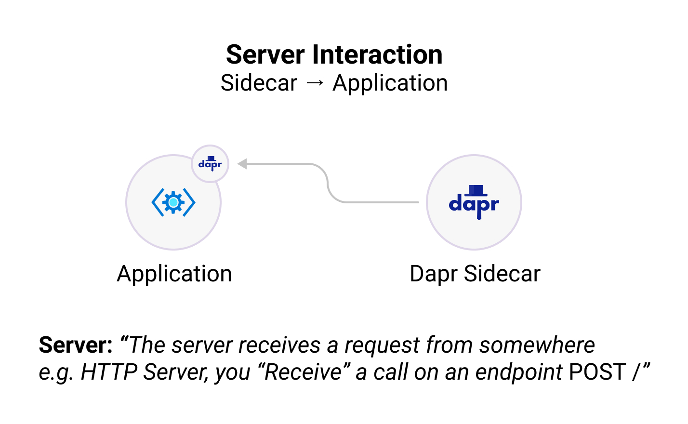
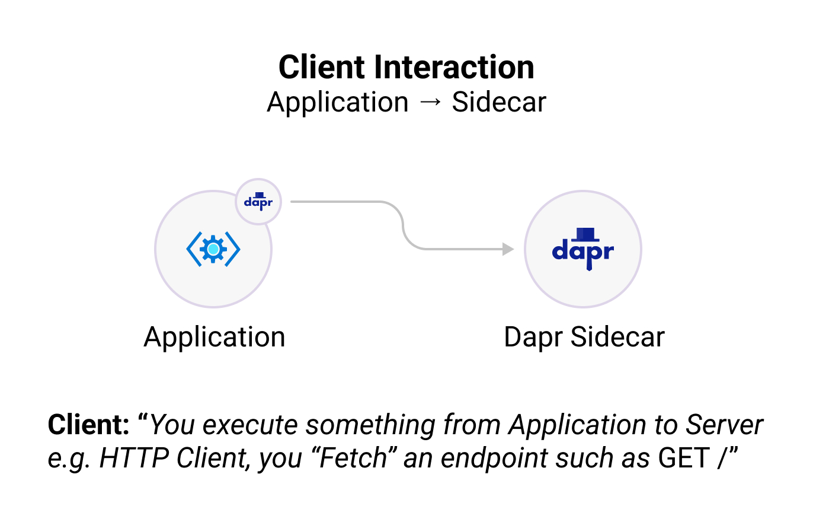

Dapr JS SDK 将允许您与 Dapr 进程进行交互，该进程抽象出几个常用功能，如服务到服务调用、状态管理、发布订阅等。

## 安装

开始使用 Javascript SDK，您可以通过运行以下命令从 [NPM](https://npmjs.org/package/dapr-client) 下载 Dapr Javascript SDK 包：

```bash
npm install --save dapr-client
```

## 结构

Dapr Javascript SDK 包含两个主要组件：

* **DaprServer：** Dapr Server管理所有从 Dapr Sidecar 到你的应用程序的通信
* **DaprClient：** Dapr Client 管理所有从应用程序到 Dapr Sidecar 的通信

上面的述通信可以配置为使用 gRPC 或 HTTP 协议。

 

## 快速开始

为了帮助您快速了解，请查看以下资源：

<div class="card-deck">
  <div class="card">
    <div class="card-body">
      <h5 class="card-title"><b>客户端</b></h5>
      <p class="card-text">创建一个 JavaScript 客户端，并与 Dapr Sidecar 和其他 Dapr 应用程序进行交互。 (e.g., publishing events, output binding support, etc.)</p>
      <a href="" class="stretched-link"></a>
    </div>
  </div>
  <div class="card">
    <div class="card-body">
      <h5 class="card-title"><b>服务器</b></h5>
      <p class="card-text">Create a JavaScript server and let the Dapr sidecar interact with your application. (e.g., subscribing to events, input binding support, etc.)</p>
      <a href="" class="stretched-link"></a>
    </div>
  </div>
  <div class="card">
    <div class="card-body">
      <h5 class="card-title"><b>Actors</b></h5>
      <p class="card-text">在 JavaScript 中创建具有状态、Timer、Reminder 和方法的 Actor。</p>
      <a href="" class="stretched-link"></a>
    </div>
  </div>
  <div class="card">
    <div class="card-body">
      <h5 class="card-title"><b>示例</b></h5>
      <p class="card-text">克隆 JavaScript SDK 仓库并尝试一些示例并快速入门。</p>
      <a href="https://github.com/dapr/js-sdk/blob/master/documentation/examples.md" class="stretched-link"></a>
    </div>
  </div>
</div>

### 可用软件包
- [DaprClient]() 用于帮助您的应用程序与 Dapr Sidecar 或其他 Dapr 驱动的应用程序进行交互。

- [DaprServer]() 用于帮助 Dapr Sidecar 与您的应用程序交互、转发事件订阅、执行方法调用等。
